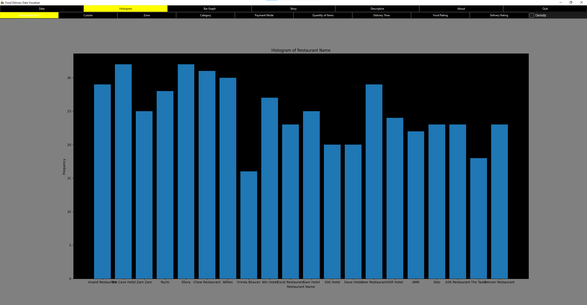
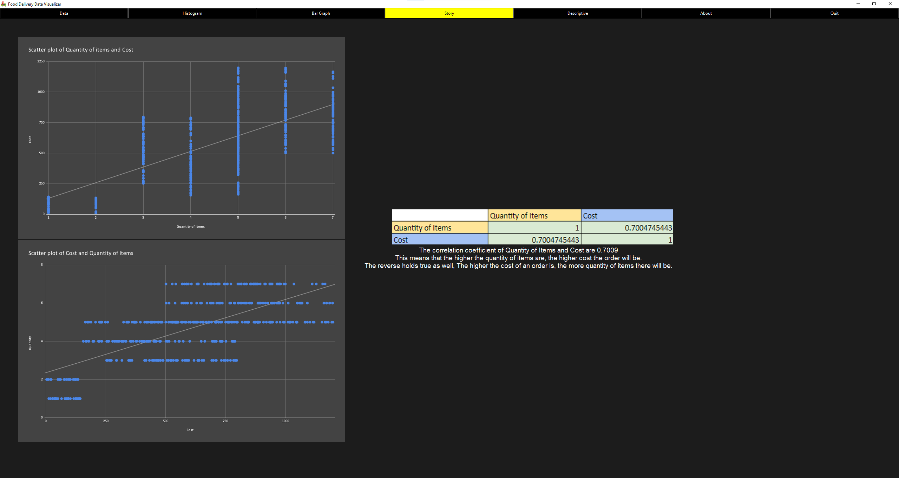

# Food Delivery Data Visualizer

---

## Main Features

Food Data Visualizer was made to help user visualize and analyze people's behavior when choosing and ordering food.<br>
This program lets user be able to : <br>
1. Filter and view data
2. Create and analyze histograms
3. Create and analyze bar graphs
4. See an example data story
5. Analyze descriptive statistics

---

## System Requirements

* Python >= 3.12
* Other packages in requirement.txt

---

## Data Source

[Restaurant Order Details](https://www.kaggle.com/datasets/mohamedharris/restaurant-order-details)

[Proposal](https://docs.google.com/document/d/1saBdR1z_1J8v7o5Eu1hJuhFq35pFtAGzNEH_F-Dq998)

---

## Screenshots

### Data Tab


### Histogram Tab


### Bar Graph Tab


### Data Story Tab


---

## Installation

a. Install git [here](https://git-scm.com/downloads) if you haven't

b. Install python [here](https://www.python.org/downloads/) if you haven't

c. Open Terminal/Command Prompt

1. Clone this repository
```
git clone https://github.com/NoMoneyDev/Food-Delivery-Data-Visualizer.git
```

2. Change directory to this project
```
cd Food-Delivery-Data-Visualizer
```

3. Create virtual environment
```
python -m venv env
```

4. Activate the virtual environment

For window:
```
.\env\Scripts\activate
```
For macOS or Linux:
```
source env/bin/activate
```

5. Install required packages
```
pip install -r requirements.txt
```

6. Run main.py
```
python main.py
```

---

## Files

| File Name       | Description                                            |
|-----------------|--------------------------------------------------------|
| main.py         | Main script used to run the program                    |
| UI.py           | The class file used to create tab                      |
| data_manager.py | The class file used to manage data and create graphs   |
| data            | Directory used to store data file                      |
| img             | Directory used to store graphs for data story and logo |
| requirement.txt | .txt file listing required packages to run the program |

---

## Diagrams

### Class Diagram


### Sequence Diagram


---

## Disclaimer

The names of the restaurants used are only for representational purposes.<br>
They do not represent any real life nouns, but are only fictional.